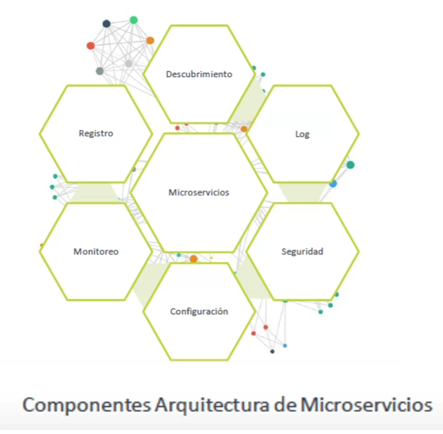
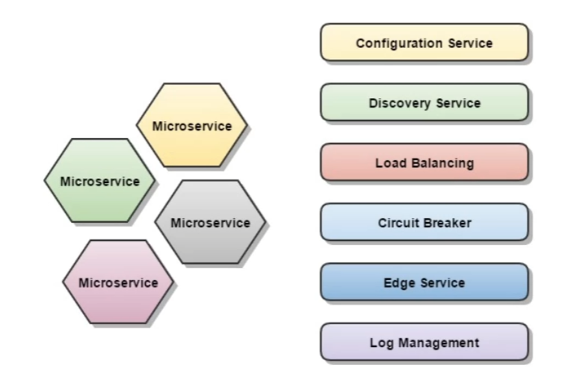
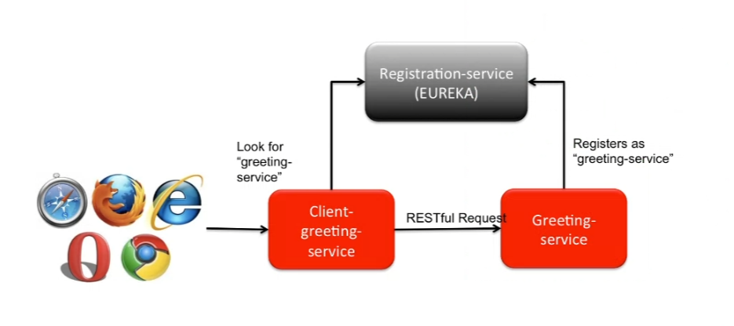
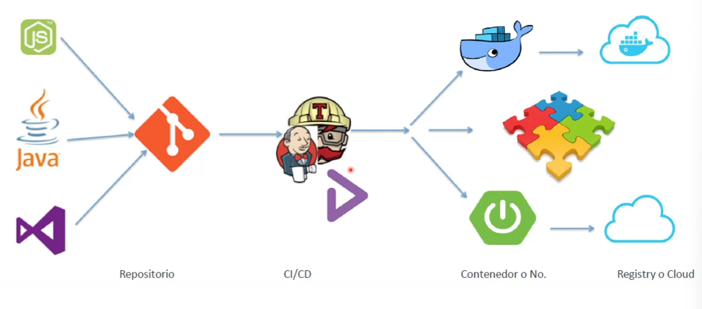

## Arquitectura y Componentes
Los microservicios son mas pequeños, desacoplados y perfeccionados para realizar pequeñas tareas de manera eficiente.

## Componentes - Descubrimiento y Orquestación
Todo microservicio en un entonor clusterizado se registra.
 Se registra cada nueva instancia dejando consigna de los datos de ubicacion, puerto, Ip...
 Cada microservicio se registra para que otros puedan hacer uso de él.

Se descubre, discoverty, permite tener acceso a la información de registro.

Eureka pone en comunicación los dos microservicios.
 Greeting-servicies, es en http, y lo que hace es saludar.
 Cuando se lanza lo primero que hace es registrarse (su ip, puerto, protocolo, etc.). 
 Para dejar sus credenciales para que Client-greeting-service pueda usarlo.
 El cliente cuando se lance además de registrarse, va a pedir comunicación con el servidor.

Una herramienta de orquestación despliega todas las herrmientas que tengo dockerizadas, y las despliega en un entorno clusterizado.
 Da una alta ??

## Enrutamiento

## Balanceador de Carga
Balancea la peticion de diferentes microservicios.
 Consulta al servidor de registros, porque es quien tiene todo registrado.

## Monitorización y Logs
ELK, elasticsearch, quivana.
 Prometeus, la gestion perfecta, pero la parte gráfica mala, por eso se usa grafana.
 Esto lo que nos permite es monitorizar, porque Docker y Podman no puede monitorizar.

## Trazabilidad de Peticiones
Spring Sleuth y Zipkin.
 Spring Sleuth, es una librería que implementa una solución de trazado distribuido.
 Zipkin, se consigue un sistema completo de trazabilidad distribuida. Podemos ver la trazabilidad completa.

## Servicios de configuración
Da remotamente la configuración a cada servicio.
 Permite gestionar el ciclo de vida y versionado.

## Vida CI/CD

