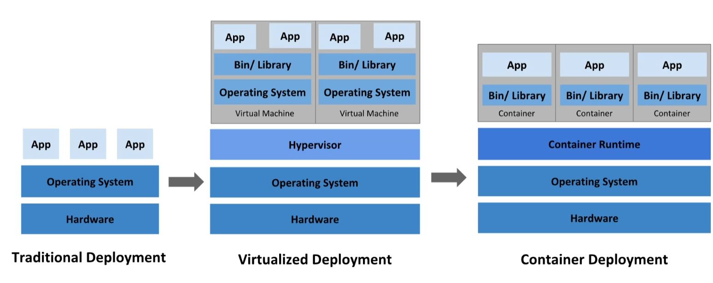

## ¿Qué es Docker?
CRI,Container Runtime Interface

Maquinas virtuales no son optimas del todo porque hay que darle parte de los recuros, aunque no lo use, a dicha máquina.
 Para correr una aplicación necesitamos tambien de un sistema operativo.
 Hay que virtualiza **todo** un sistema operativo.

Con los contenedores, se soluciona porque se comparten los recursos y se van pidiendo parte de los recursos.
 Dentro de un mismo hardware tenemos una aplicación directamente, no nos hace falta montar un sistema operativo.

## ¿Qué es un contenedor?
Es un proceso en el SO que contiene todas las aplicaciones necesarias.
 El contenedor si que necesitará las librerías necesarias para que nuestro programa funcione.

El arranque de un contenedor es mucho más rápido, porque es un proceso dentro del SO. Sin embargo una maquina virtual tiene que arrancar todo el So propio y la aplicación.

## Gestión de Recursos

Docker,
+ libcontainer, instala los contenedores.
+ LXC, 

Linux kernel,
+ cgroups, puedes definir el consumo de recursos en el SO.

## Namespace Linux
Cuando lanzo un contenedor se lanza con una serie de namespace, el namespace me da esa independencia.
 Esta independencia se consigue con el PID, independent procesor.

Cuando se crea un contenedore crea estos namespaces:
+ IPC, Inter PRocess Communication, dentro de un contenedores se comunican los procesos sin problema. Pero diferentes contenedores no se pueden comunicar los procesos. El IPC sirve para poder comunicarlos.
+ network, cuando se crea el contenedor tendrá una IP única y tendrá su propia "red" y solo podrá ver esa "red".
+ mount, nos permite "montar" archivos externos, es decir, podemos compartir el sistema de archivos del host en el contenedor.
+ UTS, nos da la habilidad de dar un hostname a un contenedor.
+ pid, numero del proceso que le da el SO donde esta corriendo.

## Estructura de Docker
El motor de docker se llama Moby.
 El containerd usa moby para ejecutar los contenedores.
 Docker (suar) nos permite gestionar contenedores en un software. Competencia de Kubernetes, que es un gestionadores de motores de CRI.