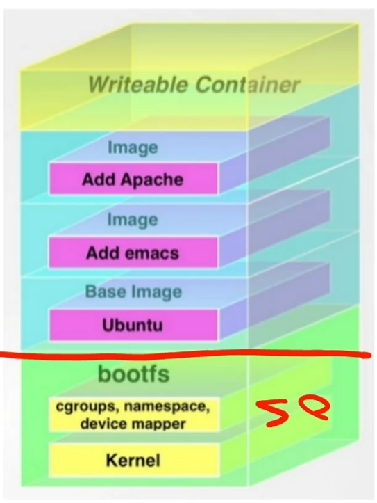

## Terminología
+ Docker Client, cliente que habla con el servicio docker.
+ Docker Daemon o Docker Engine, servicio que recibe las peticiones.
+ Docker Hub, repositorio público de imágenes, donde se puede crear su propio repo. Los fabricantes de software tienen las imagenes de sus productos.
+ Docker Containers, aquí se ejecutará mi aplicación. Es el percutor de que pueda y sepa arrancar la aplicación que esta dentro de mi imagen.
+ Docker Images, aquí dentro estará mi aplicación.
+ Docker Files, gracias a él puedo automatizar la creación de mis imágenes.

El cliente de docker puede ser:
+ Externo, esta fuera de la máquina, y puedo enviar peticiones a él.
+ Interno, esta dentro del mismo SO de.

## Docker Images

De SO para arriba es cuando nace nuestro contenedor (línea roja para arriba).
 La imagen es lo que esta de color **azul**, y es Read Only.
 Mi aplicación esta compuesta de más de una capa:
+ Base Image, tiene el SO.
+ Add emacs, es un compilador.
+ Add Apache, es quien ejecuta mi aplicación.

La parte **verde** de arriba es el contenedor, y aquí si podre guardar los cambios que se hacen en la imagen.

## ¿Dónde se guardan las imágenes de docker?
+ Publicas, para todo el mundo.
+ Privado, solo se acceder bajo autorización (pago).
+ Registro local propio, se implementa un servidor de registro propio.

## Arquitectura de Docker Engine
Para crear un contenedor necesito una imagen y dicha imagen tiene que estar en **local**.
 Si no tengo esa imagen en local, lo que hara será Docker Host buscar la imagen en el Docker Daemon, y si ahí no esta se buscará en el registro.

UFS, union filesystem, overlay. Es la parte de Writeable Container de la [imagen](img/image-6.png).

## Flujo de trabajo con Docker Engine
