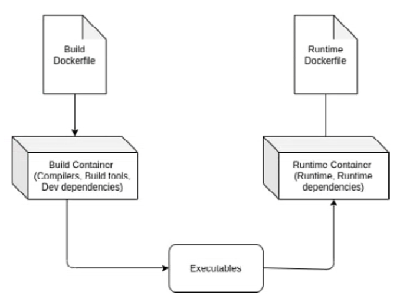
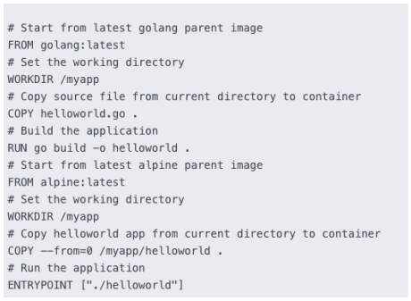

## Construciones normales de Docker

Cuando se crea una imagen se suele exigir 2 cosas:
+ Pese poco,
+ Haya pocas capas, porque cuantas más capas, más tiempo de compilación, más tiempo de arranque y más ocupa en cache.

La finalidad del Dockerfile e

```Dockerfile
FROM goland:latest
WORKDIR /myapp
COPY helloworld.go .
RUN go build -o helloworld .
ENTRYPOINT ["./helloworld"]
```

Mi objetivo es poder ejecutar cada vez que arranco ese binario y lo estoy haciedo a traves de una imagen base golang:latest hay una incoherencia el tamaño.<br>
golang:latest tiene mas de lo que yo neceisto, hay cosas que no necesita.<br>
Solo haría falta los binarios de ejecución.

## Patrón Builder


Vamos a crear una imagen para compilar, Build Dockerfile. Con esta imagen creare un Build Container.<br>
Y otra imagen para solo ejecutar mis ejecutables, Runtime Dockerfile. Con esta imagen creare un Runtime Container.<br>
Para hacer esto hace falta crear un script para que coordine esto.

## Docker multi-stage
Es un patron de compilación multietapas, lo que nos permite en un unico dockerfile tener varias etapas que produzcan imagenes optimizadas.<br>
Nos permite tener varios FROM, y podemos llamar entre las diferentes etapas.



`COPY --from=builder /resources /resources` --from me permite copiar de otra etapa de mi Dockerfile.<br>
En el ejemplo yo como tal solo uso mi última etapa que es la que tiene el ENTRYPOINT.

El fichero .dockerignore me permite incluir ahí ficheros que no quiera que se copien cuando se hace un COPY al compilar una imagen de un Dockerfile.

Cuando se hace esto, si hay un error de compilación el Dockerfile no se parara, seguirá creando las imagenes.
