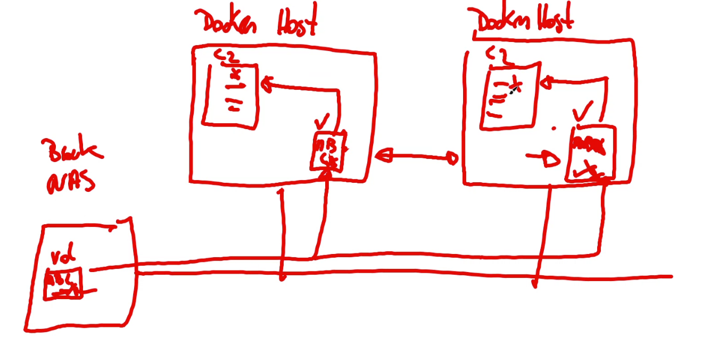

## Almacenamiento Docker

+ Bind mount, lo gestiona el SO, le comparte el SO al contenedor mediante el namespace. 
Puede que me tenga que pelear con los grupos de usuario porque esta gestionado por el SO directamente.
+ Volume, es una ruta de montada en un contenedor, gestionado por docker.  
Si se borra un contenedor no se borra el volumen asociado. 
Da una gestión a nivel de Docker. 
Es "mejor" porque se lo puedo dar a todos los contenedores que monten.

Para el contenedor ambos son iguales, tiene un sistema de archivos.

## Bind Mount
Se hace añadiendo -v cuando se crea u contenedor: 
`docker run [-v] [path/host:path/container | path/host]`

## Volume
+ `docker volume create --name nombre` crea un volumen con ese nombre.
+ `docker volume ls` me dice los volumenes que hay creados.
+ `docker inspect volumenName` me dice mas datos sobre ese volumen
+ `docker run -v nombreVol:path/que/quiera` me crea un contenedor con con acceso a dicho volumen.

Los volumenes se guardaran en path donde se haya guardado docker en su instalación.

Si queremos compartir un mismo directorio don dos Docker Host diferentes necesitaré de algún sistema de gestión de ficheros externo (NAS, Block, Samba, etc).

`showmount -e server1` me dice que carpetas comparte un servidor. 
`docker volume crate --driver local --opt type=nfs --opt o=addr=10.100.0.254,ro --opt device=:/export/netinstall/CENTOS7 PKG` esto me monta como read only una carpeta de un servidor diciendo que es de tipo nfs y que esta en el servidor 10.100.0.254. 
`docker run -ti -v PKG:/package --name fileserver` ubuntu esto me crea un contenedor que tiene una carpeta /package que esta conectada con el servidor directamente. 

¿Que pasa con los bloqueos? Eso ya no lo gestiona docker, se tiene que encargar a quien le toque.

## Mapeo de Dispositivos
Tambien se pueden mapear dispositivos como un disco duro.

