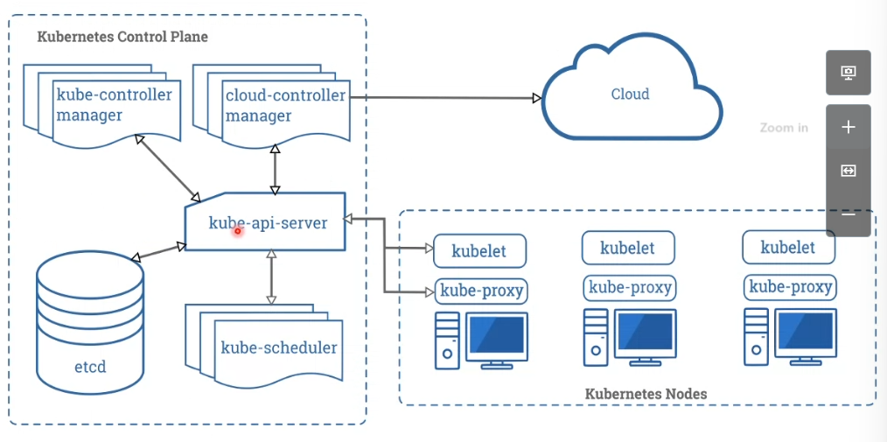

## Introducción a Kubernetes
"Es un Orquestado de Docker", porque la filosofía de kubernetes es un orquestador de CRI. 

No es:
+ Una plataforma pass, opera a nivel de contenedor, no a nivel de hardware. Si ofrece algunas cosas que las pass como balanceo de cargas, registros, etc.
+ Un deployment,
+ No compila imagenes.

### Funcionalidades

+ Binpackaging automatico, 
+ Autoreparación, se encarga de reiniciar los contenedores que falle, y reprogramar si los nodos fallan, matar los contenedores que no dan su chekeo de salud.
+ Escalabilidad vertical, 
+ Se encarga de que los contenedores tengan sus propias IPs,
+ configmap, le podemos meter los parametros y los ficheros de configuración que necesiten mis contenedores para que arranquen.

kubectl se comunica con la api de kubernetes.

### Componentes Master Node

+ kube-api-server, me permite comunicar kubernetes, este componente es el que acepta las peticiones.

