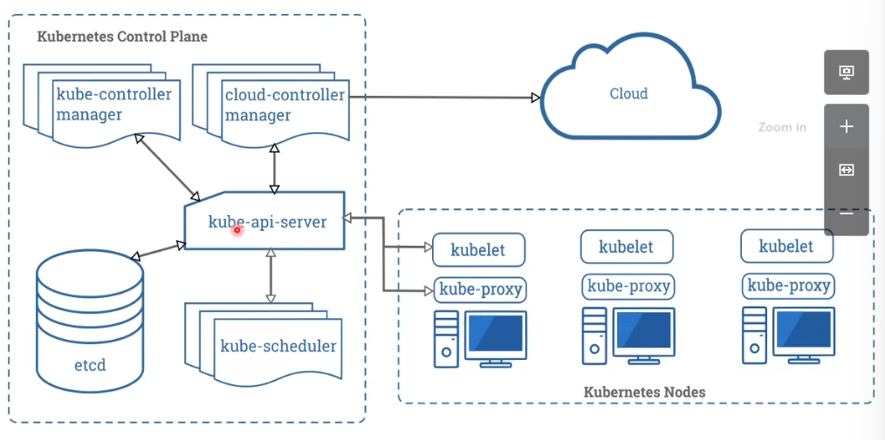

## Arquitectura de Kubernetes

Esta compuesto por nodos worker y master.

### Componentes Master Node
El conjunto de uno o mas de un master se llama control play. 
Y tiene una serie de componentes, que nos permiten gestionar el cluster y los despliegues.

El cliente que habla con Kubernetes es QFTL.

+ kube-api-server, me permite comunicar kubernetes, este componente es el que acepta las peticiones. 
Son peticiones a nivelk cluster, despliegue de aplicación, no a nivel de servicio de la aplicación. 
Le pasa las peticiones a kube-scheduler.
+ kube-scheduler, decide en que workers se hacen los despliegues. 
+ kubelet, que esta instalado en los workers. Tiene una continua comunicación con los master para pasarle info a nivel contenedor/nodo. 
Recepciona las peticiones del kube-scheduler, y se encarga de gestionar la creación de los contenedores. 
Los workers tendrán que tener instalado un CRI y será con el que se creen los contenedores.