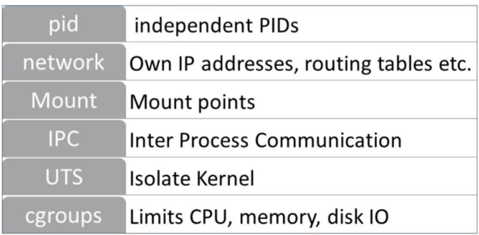
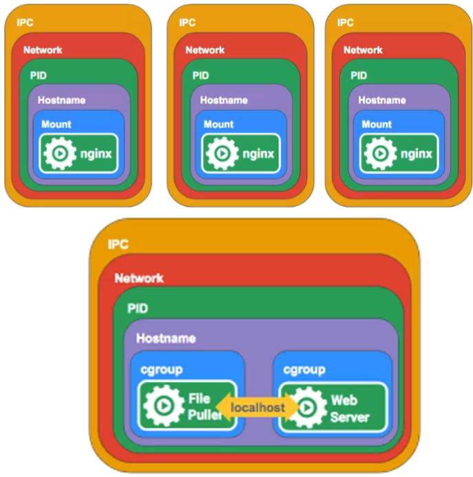
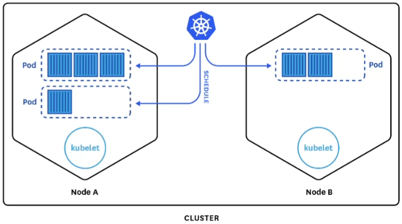
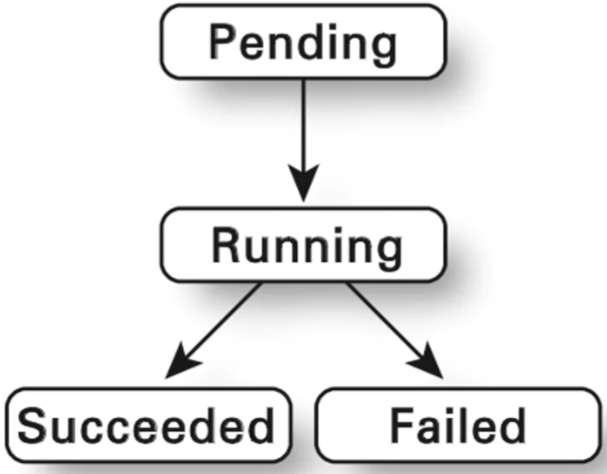
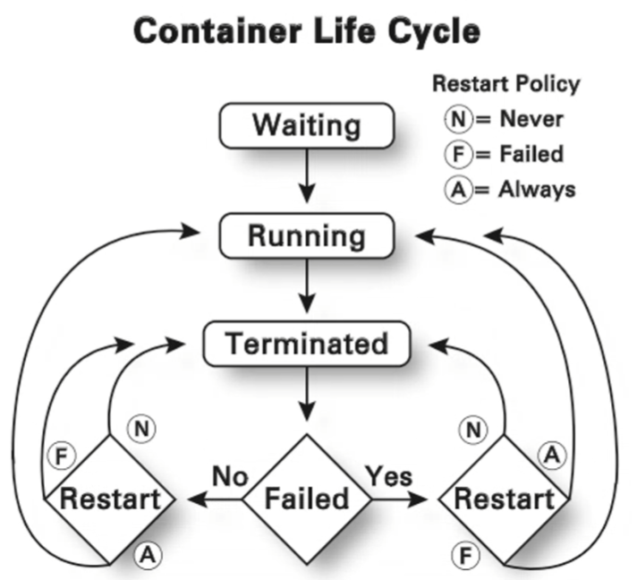
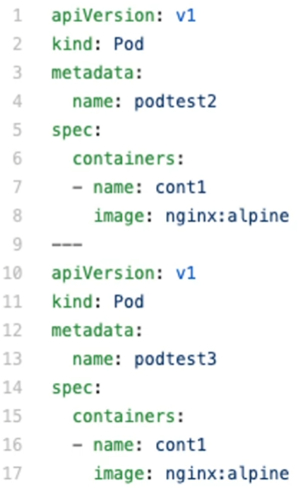
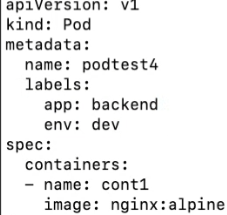
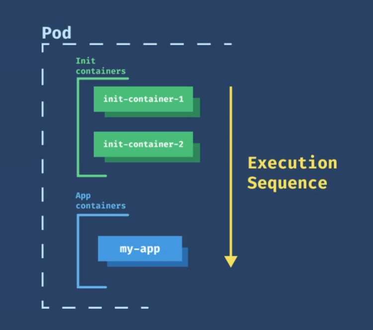

## Gestión de Pods

Vamos a empezar la gestión de objetos de Kubernetes desde el más bajo nivel.

Repaso:

Se remacan 3 namespaces:
+ IPC, dentro del contenedor todos los procesos pueden comunicarse entr todos, pero a nivel de contenedor esto no pasa.
+ Networking, cada contenedore crea su propio network, cada contenedor tiene una ip unica, y se le hace creer que tieen su network.
+ UTS, cada contenedor tiene su propio hostname,

Un pod esta constituido por uno o mas de un contenedor. 
Cuando se levanta se levanta un pod, que tiene de 1 a N conteendores, cuando se matan se matan a todos los contenedores. 
Se manejan todos a la vez. 
No es un proceso, es un objeto, no corre en el sistema. 
Es una únidad minima de despliegue en kubernetes. 
El objetivo de un pod es crear contenedores.

Un pod lo que hace es compartir un namespace entre contenedores. 
Un pod comparte un único UTS para todos los contenedores. 
Esto sigfinica que los contenedores estan relacionados entre sí.

¿Cuantas réplicas (copias de un pod) hay? No hay replicas, porque no hay dos pods iguales.

### Ciclo de vida de un POD

+ Running, los contenedores del pod se han creado y al menos un contenedor se esta ejecutando o esta en proceso de creación.
+ Succeeded, los contenedores han finalizado su ejecución y todos han terminado OK.
+ Failed, los contenedores han finalizado su ejecución y al menos uno ha terminado mal.
+ Unkown, el estado del POd no se puede saber, esto pasa cuando se pierde comunicación entre nodos.
+ Crack no back of, hay un contenedor que se este reiniciando en bucle.

+ Running, ejecutandose sim problemas.
+ Terminated, se ha terminado o por fallo o por no fallo.

### Algunos Comandos de kubectl
+ `kubectl get pod podName -o yaml` te da la configuración actual de ese objeto.
+ `kubectl logs podName -c containerName` me da los logs del pod.
+ `kubectl exec -ti podName -c conatinerName /bin/sh` accedo a un contenedor.
+ xxx si el namespaced es false es un objeto que pueden ver todos los namespaces, en kind me dice el tipo de objetos que hay.

### Manifest de Kubernetes

Nosotros vamos a desplegar objetos desde un manifest. 
Los valores del manifest los podemos ver al hacer xxx.
En la parte de spec especificamos los contenedores y como se crean.

Diferencia entre apply y create, si se hace un apply y se ha modificado el yml aplica cambios, el create lo crea de nuevo.

+ `kubectl delete -f manifest.yml` borra todos los objetos pod que haya en dicho fichero.
+ `kubectl apply -f manifest.tml` crea el pod.

#### Labels
Se pueden crear etiquetas para un objeto. 

+ `kubectl get podName -l app=label`, puedo filtrar por etiquetas.

### Sondas
Docker no controla nuestra aplicación, gestiona un contenedor. 
Cuando para? cuando el PID 1 del contenedor para. Pero puede ser que algunas aplicaciones fallen pero dejen vivo el PID 1. 
Como saber si esta vivo o no? Con sondas, que estan prestablecidas por kubernetes.

Algunos tipos de sondas que nos da Kubernetes son:
+ Exec action, ejecuto u comando especifico dentro del contenedor, el diagnostico genera exitoso si sale con un estado 0.
+ TCP Socket Action, realiza una coimprobacion tco contra la direccion ip del contendore en un puerto especifico. El diagnostico es OK si el puerto esta abierto.
+ Http get action,  realiza una solicitud hhtp contra la ip del contenedor en puerto y ruta especifica, se considera OK si es > 200 y <400.
+ Rediness, informan a kubernetes cuando su app esta lista para servir tráfcico. Se asegura que la sonda este lista antes de mandar trafico.
+ Liveness, me dice si la aplicacion esta viva o no. Si esta muerta kubernete creara otro contenedor para lanzar la aplicación.

Si por ejemplo, mi pod tarda 1 min en levantarse, kubernetes no espera ese min a que este levantado. Pero si usamos una sonda de rediness espera a que esta sonda este lista antes de mandarle trafico.

### Contenedores init

Sejecutan antes de los de mi aplicacion en un pod. Pueden contener utilidades o scripts de instalación no presentes en una imagen de la aplicación. 
Siempre se ejecutan hasta su finalización. Debe completarse antes de que empiece el siguiente. 
Se pueden poner en la especificación del pod. 
Si falla, Kubernetes reinicia dicho contenedor hasta que tenga exito, pero se puede configurar para que si falla Kubernete trate a dicho contenedor como fallido.

#### Estados del POD
+ init:N/M,
+ init:Error, el contenedor no se ha podido ejecutar.
+ init:CrashLoopBackOf, ha fallado indefinidamente.
+ Pending, aun no ha comenzado
+ Running, el pod ya ha terminado.
