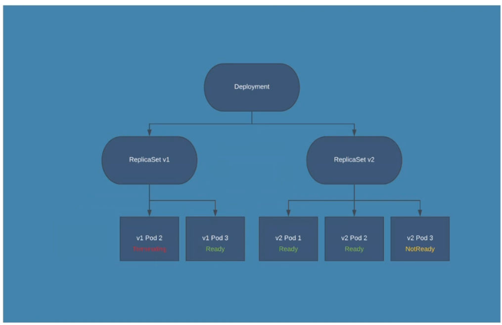
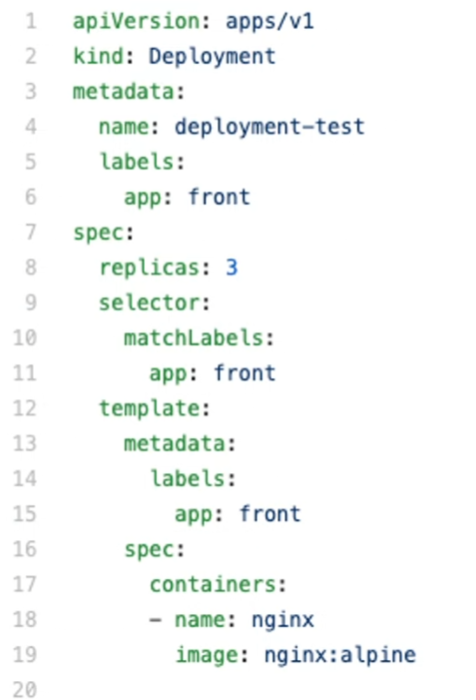

## ReplicaSet
Es un objeto separado del pod, esta a un nivel mas alto, crea pod. 
Si un pod muere, el replicaset se dará cuenta, y creara un nuevo pod de esa replica, ya que se encarga de que hay aN replicas de un pod.

### ¿Como crea y mantiene los pods?
Los pods de un replicaset tiene que tener un label obligatoriamente. 
Porque levanta los pods dado un label, si un replicaset no encuentra un pod con dicho label lo creara.

El pod tendra un propietario, un owner reference.

Al borrar un replicaset se borraran todos los pods que controla. 
Los ultimos pods en nacer son los primeros en morir.

El no mira si ha cambiado algo del pod, si cambia no lo actualiza, el solo se encarga de mirar el numero de replicas que hay. 
Eno se de cuenta de los cambios, solo se dara cuenta cuando le vuelvan alanzar, ya sea con apply o create. 
Hay una carencia porque puede haber inconsistencias porque si se hace el apply el no creara de nuevo los que ya tenía, y habrá pods con dos versiones. 
Estas carencias solventan con Deployments.

## Deployment
Es el dueño de un replicaset. 
Cuando lo cree tendre que decirle que replicaset tendrá. 
Un replicaset va ligado a una version y a un pod. Por eso, se creara otro replicaset con la nueva versión. 

### Strategy Rolling update

Irá actualiznado poco a poco el replicaset. 
Ira matando y creando los pods en los dos replicaset. 
Esto se configura con:
+ MaxUnnavaible, que por defecto es 25%, significa que el 25% tendrán que estar activos siempre, y podran morir el 25%.
+ Y MaxShorts, cuanto voy a permitir adicional al 100% que se creen pods nuevos. Por defecto tambien es el 25%.

Esto lo hara de manera que no se porduzcan caidas de los pods.

Estya definiendo que tiene que crear 3 replicaset, y se liga todo con las labels, igual que en los pod con los replicaset.

+ `kubectl rollout status deploy deployName` me dice como es el proceso del deploy al hacer un rolling update.
+ `kubectl rollout history status deploy deployName`me da un hitorial que dice que ha habido cambios, pero no me dice los cambios.
+ `kubectl rollout status deploy deployName --revision=N` y podría comprar con el anterior.
Por eso cuando se hace un cambio se recomienda poner un `annotations:` para poder tener un registro mas controlado de los cambios que se van produciendo.