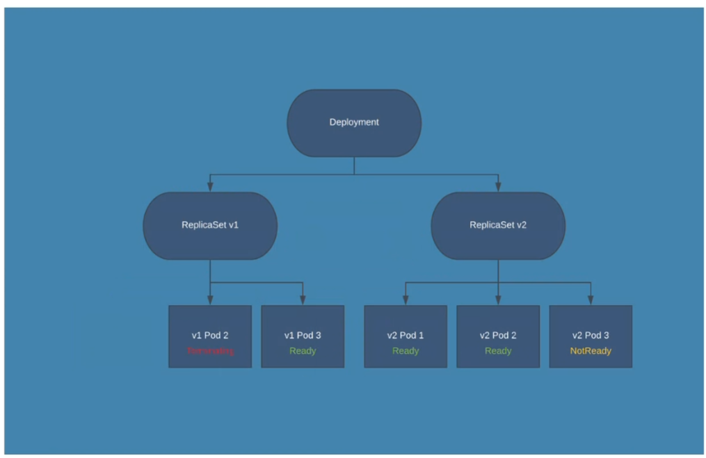

## Deployment
Es el dueño de un replicaset. 
Cuando lo cree tendre que decirle que replicaset tendrá. 
Un replicaset va ligado a una version y a un pod. Por eso, se creara otro replicaset con la nueva versión. 

### Strategy Rolling update

Irá actualiznado poco a poco el replicaset. 
Ira matando y creando los pods en los dos replicaset. 
Esto se configura con:
+ MaxUnnavaible, que por defecto es 25%, significa que el 25% tendrán que estar activos siempre, y podran morir el 25%.
+ Y MaxShorts, cuanto voy a permitir adicional al 100% que se creen pods nuevos. Por defecto tambien es el 25%.

Esto lo hara de manera que no se porduzcan caidas de los pods.

Estya definiendo que tiene que crear 3 replicaset, y se liga todo con las labels, igual que en los pod con los replicaset.

+ `kubectl rollout status deploy deployName` me dice como es el proceso del deploy al hacer un rolling update.
+ `kubectl rollout history status deploy deployName`me da un hitorial que dice que ha habido cambios, pero no me dice los cambios.
+ `kubectl rollout status deploy deployName --revision=N` y podría comprar con el anterior.
Por eso cuando se hace un cambio se recomienda poner un `annotations:` para poder tener un registro mas controlado de los cambios que se van produciendo.